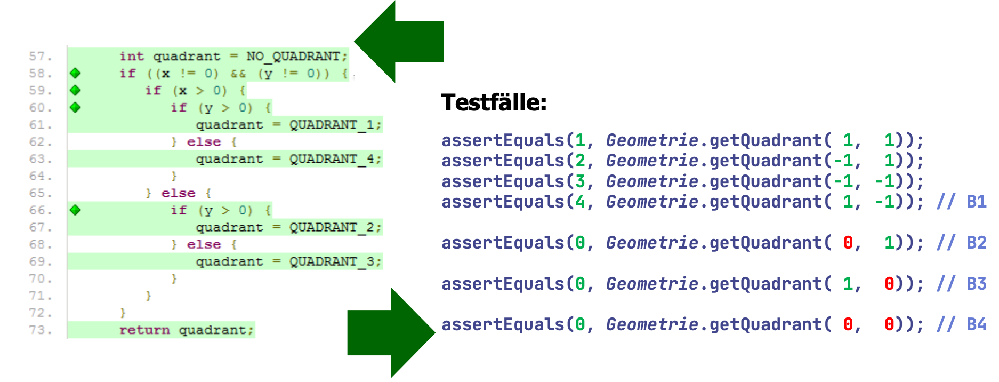

# Clean Code: Unit Tests

## Motivation

Gute und umfassende Tests sind die fundamentale Basis für alle weiteren Bemühungen zur Verbesserung der Code-Qualität. Qualität in Form von:&#x20;

* Reliability
* Changeability
* Efficiency
* Security
* Maintainability
* Portability
* Reusability

Gute Unit Tests sind die erste, schnellste und einfachste Teststufe. Es gibt schnelles erstes Feedback, ob es Funktioniert. Regression ist die Basis für jedes Refactoring.

## Was ist ein Unit Test?

Nicht alles was JUnit verwendet ist auch ein Unit Test. JUnit kann zur Automatisation von beliebigen Testarten verwendet werden.

_«A unit test is an automated piece of code that invokes a unit of work in the system and then checks a single assumption about the behavior of that unit of work.»_

## Test Driven Development

Es gibt drei Gesetze für das TDD:&#x20;

* Produktiver Code darf erst implementiert werden, wenn es dafür einen Unit-Test gibt
* Dieser Unit-Test darf nur gerade so viel Code enthalten, dass er fehlerfrei kompiliert, aber als Test scheitert.
* Man ergänzt jeweils nur gerade so viel produktiven Code, dass der scheiternde Test besteht.

Der Zyklus dieses Ablaufs liegt dabei im Bereich von Sekunden bis Minuten. Tests und Produktivcode werden praktisch zeitgleich geschrieben.&#x20;

## Tests sauber halten

Für Testcode sollen die identischen Qualitätsstandards gelten wie für produktiven Code. Gute Namensgebung, gute Struktur und Verständlich. Wer denkt: Besser schmutzige Tests als gar keine Tests, der ist auf dem Holzweg!&#x20;

Begründung: Testcode lebt länger als produktiver Code. Produktiver Code wird z.B. refactored. Wenn Testcode erodiert, dann haben wir doppelt verloren.&#x20;

Testcode dokumentiert den produktiven Code. Muss umso mehr wart- und erweiterbar sein. Es ist ein weiter Weg von Unit Tests zu guten Unit Tests!

## Was ist ein sauberer Unit Test?

Drei Dinge machen einen sauberen Unit Test aus:&#x20;

1. Lesbarkeit durch Klarheit
2. Lesbarkeit durch Einfachheit
3. Lesbarkeit duch Ausdrucksdichte

Lesbarkeit ist bei Testcode noch wichtiger als bei Produktivcode. Mit möglichst wenig Code möglichst viel aussagen. Jeder Testfall nutzt das Bild-Operate-Check-Pattern:&#x20;

1. Erstellen der Testdaten
2. Manipulieren der Testdaten
3. Verifikation der Ergebnisse

Vergleiche auch: Tripple-A Pattern: Arrance, Act, Assert

## Domänen spezifische Testsprache

Wir schreiben uns ein domänenspezifisches Set von (typisch statischen) Utility Methoden, welche

* den Testcode kompakter und aussagekräfiger machen
* ihrerseits natürlich die API des Teskandidaten verwenden

Beispiel für eigene assert-Methoden:

```java
assertResponseIsXML()
assertResponseContainsElement(…)
```

\-> Identischer Ansatz wie bei AssertJ- oder Hamcrest-Library: Möglichst aussagekräftige und leichtverständliche Ausdrücke verwenden

## Nur ein Assert pro Test

Es eist eine sehr drakonische Forderung, aber nicht immer sinnvoll umsetzbar, aber wenn: Viel besser! Weniger assert-Messages notwendig, weil die Testfälle selber schon sehr selektiv sind. Einzelne Testmethoden werden überschaubarer und kleiner.&#x20;

```java
@Test
testPersonEquals() { 
    assertEquals(soll, ist);
}
```

## Nur ein Konzept pro Test

Auch bei Tests soolte man SLA, SRP und SOC einhalten.

* Single Level of Abstraction
* Single Responsibility Principle
* Seperation Of Concerns

Eine untrügliches Zeichen für Verletzung:&#x20;

* Eine Testmethode wird in mehrere Abschnitte gegliedert, vielleicht sogar noch mit Kommentarblöcken unterteilt.&#x20;

Zu grosse und lange Testmethoden sind mühsam!

* viele wenige selektive failure-Meldungen
* Wenige gezielte Wiederholungen des Tests möglich
* Kurz: Alle Nachteile von zu grossen Methoden

## F.I.R.S.T - Prinzip

**F**ast - Tests sollen schnel sein, damit man sie jederzeit und regelmässig ausführt.

**I**ndependent - Tests sollen voneinander unabhängig sein, damit sie in beliebiger Reihenfolge und einzeln ausgeführt werden können.

**R**epeatable - Tests sollten in/auf jeder Umgebung lauffähig sein, egal wo und wann.&#x20;

**S**elf-Validating - Tests sollen mit einem einfachen boolschen Resultat zeigen ob sie ok sind oder nicht.

**T**imely - Tests sollen rechtzeitig, d.h. vor dem produktiven Coe geschrieben werden -> Test First

## Uncle Bob's Unit-Tests Heuristiken

<details>

<summary>T1: Unzureichende Tests.</summary>

Meistens wird nur bis «zum Gefühl dass es reicht» getestet. Clean Code fordert: Es wird alles getestet, was schief gehen kann!

Man schreib so lange Tests

* wie es Bedingungen gibt, die noch nicht geprüft wurden
* Berechnungen stattfinden, die nicht validiert werden

Faktisch bedeutet das eine 100%-ige Testabdeckung. Das ist aber nicht überall eine realistische Foderung. Aber sicher ein gutes Ziel um Fortschritte zu machen.&#x20;

</details>

<details>

<summary>T2: Coverage-Werkzeug verwenden. </summary>

Coverage-Werkzeuge decken Lücken in den Tests auf. Statement- und Decision-Coverage beachten!



</details>

<details>

<summary>T3: Triviale Tests nicht überspringen.</summary>

Manchmal gibt es Tests, die man nicht macht, weil man der Meinung ist, sie seien zu trivial (Setter- / Getter). Clean Code Dokumentarischer Wert der Testfälle übersteigt die Produktionskosten -> es lohnt sich doch! Die Abdeckung wird vergrössert und es ist ein Motivationsfaktor, weil sie sind einfach zu schreiben.&#x20;

_Keine Klasse, keine Funktion ist zu klein, um nicht automatisch getestet zu sein!_

</details>

<details>

<summary>T4: Ignorierte Tests zeigen Mehrdeutigkeit auf. </summary>

Test auskommentiert oder (besser) deaktiviert:

```java
@Disabled("Gibt es eigentlich einen Nullpunkt?")
@Test
void testGetQuadrantNullpunkt() {
    assertEquals(0, Geometrie.getQuadrant(0, 0));
}
```

Wenn ein Testfall deaktiviert ist, deutet das häufig auf eine Unklarheit in den Anforderungen hin. Deaktivierte Testfälle sind somit ein Warnsignal! Temporär ok, aber nie als Providurium.&#x20;

</details>

<details>

<summary>T5: Grenzbedingungen testen. </summary>

Testen mit Grenzwerten ist wichtig! Meist wird «die Mitte» eines Algorithmus richtig implementiert, aber seine Grenzen falsch beurteilt.

```java
public long addition(int sum1, int sum2) {
    long result = (long) sum1 + sum2;
    System.out.println("Addition ergibt: " + result);
    return result;
}
```

```java
assertEquals(2 * Integer.MAX_VALUE,
t.addition(Integer.MAX_VALUE, Integer.MAX_VALUE));
```

Konsolenausgabe: `Addition ergibt: 4294967294`

</details>

<details>

<summary>T6: Bei Fehlern die Nachbarschaft gründliche testen.</summary>

Fehler treten oftmals gehäuft auf. Findet man in einer Klasse / Funktion einen Fehler sollte man diesen erschöpfend testen. Es besteht eine hohe Wahrscheinlichkeit, dass darin noch weitere Fehler gefunden werden.&#x20;

Murphy's Law sagt:&#x20;

* Meist ist ein kleiner Fehler nur dazu da, dass sich dahinter ein viel grösserer Fehler verstecken kann.&#x20;
* Findet man hingegen einen grossen Fehler, wird sich dahinter ein anderer grosser Fehler verstecken.&#x20;

</details>

<details>

<summary>T7: Muster des Scheiterns zur Diagnose nutzen. </summary>

Wenn man genügend (und mit hoher Codeabdeckung) testet, kann man in scheiternden Tests manchmal Muster erkennen!

Beispiel:&#x20;

* Alle Tests scheitern, bei welchen ein String eine bestimmte Länge überschreitet
* Alle Tests scheitern, bei welchen ein bestimmtes Argument negative Werte erhält.&#x20;

</details>

<details>

<summary>T8: Hinweise durch Coverage Patterns beachten. </summary>

Wenn ein Testfall scheitert: Codeabdeckung studieren! Manchmal erkennt man aufgrund der Zeilen die (nicht) ausgeführt werden sehr schenll den Fehler.&#x20;

</details>

<details>

<summary>T9: Tests sollen schnell sein</summary>

Langsame Tests werden selten oder gar nicht ausgeführt. Ein Test, der nicht ausgeführt wird, ist nichts Wert. Unit-Tests sollten schnell sein, damit man sie immer und jederzeit ausführt. Darum sollten die Tests auch nicht zu gross sein. Man soll alles Erforderliche tun, um die Tests zu beschleunigen!

</details>
